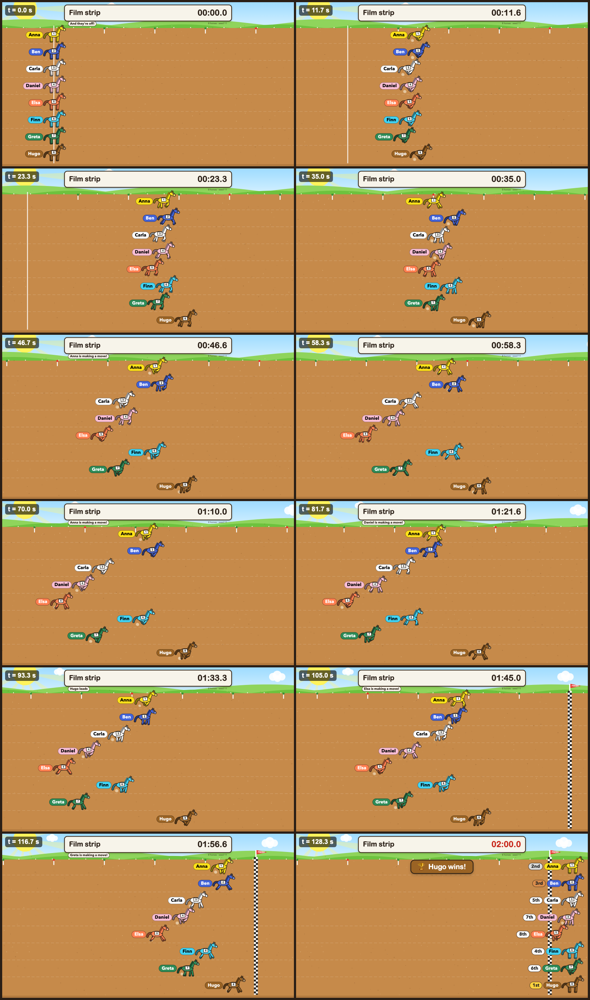

# HorseDraft 🐎

Free horse-race name randomizer for the Mac. Type up to 20 names, press Start, the horses decide.



```bash
git clone https://github.com/rofessori/horsedraft.git && cd horsedraft
./scripts/bootstrap-mac.sh && npm run app        # or npm run dist:mac for a .dmg
```

Keys, URL parameters, race files, development: [docs/USAGE.md](docs/USAGE.md). Recording with
OBS: [docs/RECORDING.md](docs/RECORDING.md).

Made by **op**, 2026. MIT licensed.
