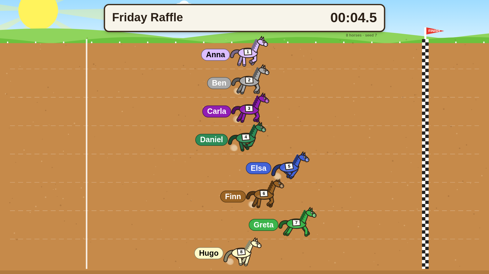

# HorseDraft 🐎

A free horse-race **name randomizer** for macOS (and any browser). Type up to 20 names, press
Start, and a field of cartoon horses gallops across the track to pick the winner and the full
finishing order. Made for raffles, "who goes first", and anything else you would otherwise
decide with a hat.



- Up to 20 names (one per line), duplicates count as extra horses
- Every horse gets a random coat colour; click a swatch to pick your own
- Animated gallop, 3-2-1-GO countdown, finish-line photo, results list with 1st / 2nd / 3rd
- Races that look real: a slow break from the gate, a pace-setter who fades, closers who come from
  behind, gaps that open and close, a sprint to the line, and every horse running through the finish
- Name each race ("Friday raffle") — it is shown on the sign board, so recordings are self-explaining
- Race length is one setting (default 60 s, 3 s to 10 min); it only changes the pacing, never the draw
- "Remove winner & race again" for raffles where everyone wins at most once
- Save / load races as small JSON files; results copy to the clipboard as text
- Reproducible: every race shows its seed, and the same seed always gives the same race
- Nothing to sign up for, no ads, no network: it is a local app

## Run it on a Mac

```bash
git clone https://github.com/rofessori/horsedraft.git
cd horsedraft
./scripts/bootstrap-mac.sh     # installs Node 22 (nvm or Homebrew) if needed, then npm install
npm run app                    # the desktop app
```

Node 22 or newer is required. With nvm, `nvm use` picks it up from `.nvmrc`.

Build a proper `.app` / `.dmg` you can keep in Applications:

```bash
npm run dist:mac               # -> release/HorseDraft-<version>-arm64.dmg
```

The app is unsigned, so the first launch needs a right-click → Open (or
`xattr -dr com.apple.quarantine /Applications/HorseDraft.app`).

Prefer a browser? `npm run dev` and open <http://localhost:5173>.

## Using it

| Key | Action |
| --- | --- |
| `Space` / `Enter` | Start the race |
| `H` | Hide / show the setup panel |
| `F` | Fullscreen |
| `Esc` | Stop the race, back to setup |
| `R` | Race again (on the results screen) |

URL parameters work in the browser and in the app (handy for OBS scenes and scripts):

```
?names=Anna,Bob,Carl&title=Friday&duration=20&numbers=1&seed=42&autostart=1&countdown=0&clean=1
```

`seed` can be a number or any word. `clean=1` hides the small toolbar so only the track is on screen.

## Recording a race with OBS

See [docs/RECORDING.md](docs/RECORDING.md). Short version: add a *macOS Screen Capture* source
for the HorseDraft window, press `H` to hide the panel, `Space` to start.

## Race files

"Save race…" writes `<race-name>.horserace.json`:

```json
{
  "format": "horsedraft-race",
  "version": 1,
  "title": "Friday raffle",
  "durationSec": 20,
  "showNumbers": true,
  "horses": [{ "name": "Anna", "color": "#e6194b" }, { "name": "Bob", "color": "#4363d8" }]
}
```

## How the draw works

The finishing order is drawn with a fair shuffle **before** the race starts, from a seed shown
on screen. The animation then plays a race whose speed curves are shaped so that lead changes
happen, but every horse crosses the line exactly in the drawn order. Watching the race is fun;
the fairness comes from the shuffle.

The race itself is modelled on real ones (see `src/core/race.ts`). Each horse gets a running
style from the seed: a **frontrunner** breaks fast and fades, a **stalker** sits just off the pace,
a **closer** starts easy and kicks hardest. One horse is always sent to the front to set the
pace, and the winner is more often a stalker or closer, so the early leader usually is not the
winner. On top of that every horse takes two to four seconds to reach racing speed, drifts
slowly faster and slower all race long, makes one to three moves, and finds another gear in the
final stretch. The length you pick is the winner's time; the field crosses over the next few
seconds (longer races spread out more) and keeps galloping through the line.

## Development

```bash
npm run dev          # Vite dev server
npm run check        # typecheck + unit tests + production build
npm test             # unit tests (vitest)
npm run e2e          # Playwright: runs real races headless and saves screenshots to test-results/shots
npm run e2e:app      # Playwright drives the real Electron app (builds first); screenshots go to the same folder
npm run race -- --names "Anna,Bob,Carl" --duration 10 --seed 42 --timeline   # a race in the terminal
```

Layout: `src/core` is the pure simulation (no DOM, fully unit-tested), `src/render` draws the
scene on a canvas, `src/ui` owns the panels and the state machine, `electron/` is the thin
desktop shell (CommonJS `.cts` files, because Electron loads its main process with `require`).

Maintainer notes live encrypted under `ai/vault/`; `npm run vault:unlock` opens them for whoever
holds the key file.

## Credits

Made by **op**, 2026. MIT licensed, see [LICENSE](LICENSE).
